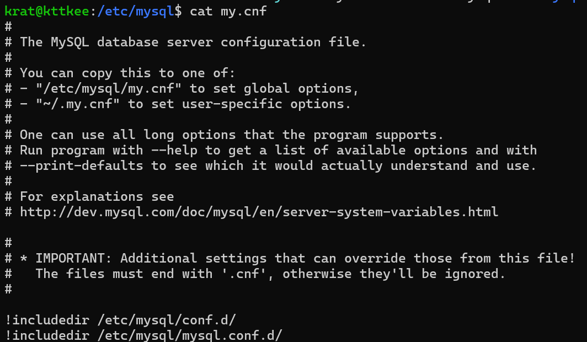
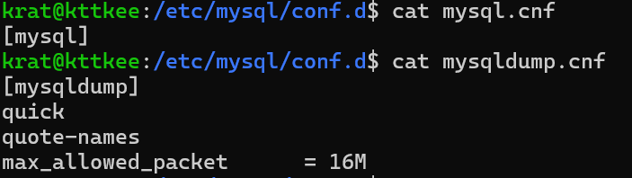
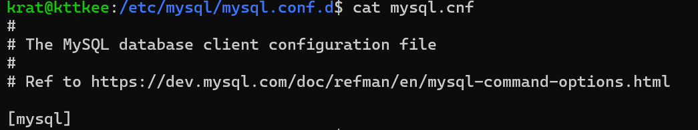
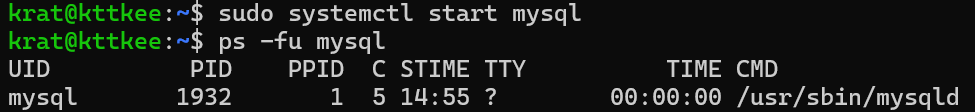
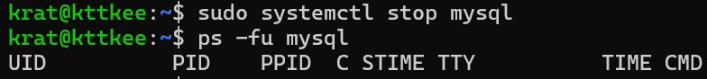
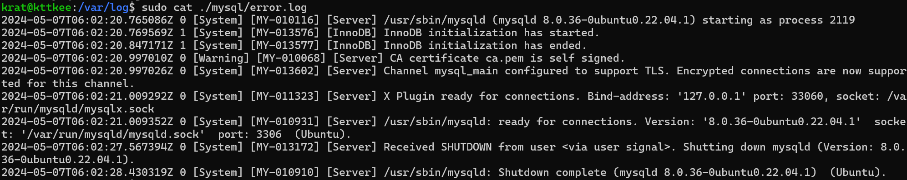
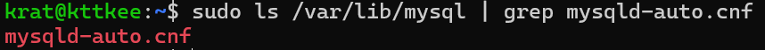

# 2장 설치와 설정

# 목차
[**설치하기**](#설치하기) <br>
[**파일들 살펴보기**](#파일들-살펴보기) <br>
[**실행**](#실행) <br>
[**서버 연결 테스트**](#서버-연결-테스트) <br>
[**서버 설정**](#서버-설정) <br>
[**시스템 변수**](#시스템-변수) <br>

<br>

# 설치하기
`sudo apt update` <br>
`sudo apt install mysql-server -y`

<br>

# 파일들 살펴보기

- `/etc/mysql/my.cnf` : /etc/mysql/my.cnf에서 발견 <br>


- `/etc/mysql/mysql.cnf` : /etc/mysql/my.cnf와 내용이 같다.

- `/etc/mysql/conf.d/mysql.conf, /etc/mysql/conf.d/mysqldump.conf` : <br>



- `/etc/mysql/mysql.conf.d/mysql.cnf` : <br>


- `/etc/mysql/mysql.conf.d/mysqld.cnf` : <br>
    ```
    #
    # The MySQL database server configuration file.
    #
    # One can use all long options that the program supports.
    # Run program with --help to get a list of available options and with
    # --print-defaults to see which it would actually understand and use.
    #
    # For explanations see
    # http://dev.mysql.com/doc/mysql/en/server-system-variables.html

    # Here is entries for some specific programs
    # The following values assume you have at least 32M ram

    [mysqld]
    #
    # * Basic Settings
    #
    user            = mysql
    # pid-file      = /var/run/mysqld/mysqld.pid
    # socket        = /var/run/mysqld/mysqld.sock
    # port          = 3306
    # datadir       = /var/lib/mysql


    # If MySQL is running as a replication slave, this should be
    # changed. Ref https://dev.mysql.com/doc/refman/8.0/en/server-system-variables.html#sysvar_tmpdir
    # tmpdir                = /tmp
    #
    # Instead of skip-networking the default is now to listen only on
    # localhost which is more compatible and is not less secure.
    bind-address            = 127.0.0.1
    mysqlx-bind-address     = 127.0.0.1
    #
    # * Fine Tuning
    #
    key_buffer_size         = 16M
    # max_allowed_packet    = 64M
    # thread_stack          = 256K

    # thread_cache_size       = -1

    # This replaces the startup script and checks MyISAM tables if needed
    # the first time they are touched
    myisam-recover-options  = BACKUP

    # max_connections        = 151

    # table_open_cache       = 4000

    #
    # * Logging and Replication
    #
    # Both location gets rotated by the cronjob.
    #
    # Log all queries
    # Be aware that this log type is a performance killer.
    # general_log_file        = /var/log/mysql/query.log
    # general_log             = 1
    #
    # Error log - should be very few entries.
    #
    log_error = /var/log/mysql/error.log
    #
    # Here you can see queries with especially long duration
    # slow_query_log                = 1
    # slow_query_log_file   = /var/log/mysql/mysql-slow.log
    # long_query_time = 2
    # log-queries-not-using-indexes
    #
    # The following can be used as easy to replay backup logs or for replication.
    # note: if you are setting up a replication slave, see README.Debian about
    #       other settings you may need to change.
    # server-id             = 1
    # log_bin                       = /var/log/mysql/mysql-bin.log
    # binlog_expire_logs_seconds    = 2592000
    max_binlog_size   = 100M
    # binlog_do_db          = include_database_name
    # binlog_ignore_db      = include_database_name
    ```

<br>

# 실행

- `/usr/lib/systemd/system/mysql.service` : `systemctl`을 이용해 `mysql` 가동/종료 가능 <br>


- `sudo systemctl start mysql` : mysql 실행 <br>


- `sudo systemctl stop mysql` : mysql 종료 <br>


- 실행 후 `/var/log/mysql/error.log`<br>


<br>

# 서버 연결 테스트
`sudo systemctl start mysql`을 실행하면 `/var/run/mysqld`가 생긴다. 만약 mysql 서버를 종료하면 `/var/run/mysqld`도 사라진다.

- #### 클라이언트 실행
    `sudo mysql -u root -p --host=localhost --socket=/var/run/mysqld/mysqld.sock` : unix domain socket (IPC의 일종)으로 실행<br>
    `sudo mysql -u root -p --host=127.0.0.1 --port=3306` : tcp/ip 소켓으로 통신 <br>
    `sudo mysql -u root -p` : 자동으로 localhost로 접속

    `--user, -u` : 로그인할 유저 <br>
    `--password, -p` : 비밀번호 <br>

- #### 접속 가능 여부 확인
    `telnet`, `nc`를 이용해 mysql 서버가 보내주는 메시지 확인 가능


<br>

# 서버 설정

여러 설정 파일이 존재하고, `mysql`은 디렉터리를 순차적으로 탐색하며 처음으로 발견된 설정 파일을 사용

`mysql --help | grep .cnf` : 
```
/etc/my.cnf /etc/mysql/my.cnf ~/.my.cnf
```

### 순서 
1. `/etc/my.cnf`
2. `/etc/mysql/my.cnf`
3. `~/.my.cnf`

<br>

### 설정 그룹

같은 파일을 공유해도 서로에게 영향은 없다.
```
[mysqld]
~
~
~
```
이 내용은 `mysqld`에만 관련된 설정

```
[mysql]
~
~
~
```
이 내용은 `mysql`에만 관련된 설정

<br>

# 시스템 변수
`mysql`에서 `SHOW GLOBAL VARIABLES`로 확인 가능

### 속성
1. `Cmd-Line` : 명령형 인자로 값 변경 가능
2. `Option file` : .cnf 파일로 변경 가능
3. `System Var` : 시스템 변수 여부
4. `Var Scope` : 시스템 변수의 적용 범위 (Global, Session, Both)
5. `Dynamic` : 시스템 변수가 정적인지 정적인지 구분

<br>

### 시스템 변수의 적용 범위
- `Global` : 서버 인스턴스 전체에 적용
- `Session & System Variable` : 클라이언트가 접속할 때 부여하는 옵션 기본값
- `Session & Session Variable` : 개별 커넥션에 부여하는 옵션값, 한 번 지정되면 변경 불가능

<br>

### 정적 변수와 동적 변수

- `동적 변수` : 서버 인스턴스에 저장
- `정적 변수` : 설정 파일에 저장

<br>

### 동적 변수 설정
---
`SET GLOBAL {option_name}={value}`로 설정 가능
```sql
SET GLOBAL join_buffer_size=524288;
```
```sql
SHOW GLOBAL VARIABLES LIKE 'join_buffer_size';
```
```
+------------------+--------+
| Variable_name    | Value  |
+------------------+--------+
| join_buffer_size | 524288 |
+------------------+--------+
1 row in set (0.01 sec)
```

+ `SET`에선 MB, GB 등의 단위 사용 불가, 수식으로 표현 

<br>

### 동적 변수와 정적 변수 설정
---
`SET PERSIST {option_name}={value}`로 설정 가능, 세션 변수에는 적용되지 않음
```sql
SET PERSIST max_connections=5000;
```
```sql
SHOW GLOBAL VARIABLES LIKE 'max_connections';
```
```
+-----------------+-------+
| Variable_name   | Value |
+-----------------+-------+
| max_connections | 5000  |
+-----------------+-------+
1 row in set (0.00 sec)
```
- `동적 변수`에는 저정됨
- `정적 변수` 적용을 위해 `mysqld-auto.cnf`에 변경 내용 추가로 저장
- 이후 `mysql` 서버가 재시작하면 `mysqld-auto.cnf`도 같이 참조해 시스템 변수로 적용



`/var/lib/mysql/mysqld-auto.cnf`의 내용
```json
{
  "Version": 2,
  "mysql_dynamic_parse_early_variables": 
  {
    "max_connections": 
    {
        "Value": "5000",
        "Metadata": {"Host": "localhost", "User": "root", "Timestamp": 1715065989256834}
    }
  }
}
```

#### 현재 인스턴스에는 저장하지 않고 `mysqld-auto.cnf`에만 저장
`SET PERSIST_ONLY {option_name}={value}`로 설정가능, 서버를 재시작하면 적용됨
```sql
SHOW GLOBAL VARIABLES LIKE 'max_connections';
```
```
+-----------------+-------+
| Variable_name   | Value |
+-----------------+-------+
| max_connections | 5000  |
+-----------------+-------+
1 row in set (0.00 sec)
```
```sql
SET PERSIST_ONLY max_connections=1000;
```
```sql
SHOW GLOBAL VARIABLES LIKE 'max_connections';
```
```
+-----------------+-------+
| Variable_name   | Value |
+-----------------+-------+
| max_connections | 5000  |
+-----------------+-------+
1 row in set (0.00 sec)
```
인스턴스에서는 변경되지 않고 `mysqld-auto.cnf`에는 저장 `/var/lib/mysql/mysqld-auto.cnf`의 내용
```json
{
  "Version": 2,
  "mysql_dynamic_parse_early_variables": 
  {
    "max_connections": 
    {
        "Value": "1000",
        "Metadata": {"Host": "localhost", "User": "root", "Timestamp": 1715066620926958}
    }
  }
}
```
`mysql`을 재시작하면
```bash
sudo systemctl stop mysql
sudo systemctl start mysql
```
또는
```bash
sudo systemctl restart mysql
```

다시 `mysql` 클라이언트를 열면
```bash
sudo mysql -u root -p
```

```sql
SHOW GLOBAL VARIABLES LIKE 'max_connections';
```
```
+-----------------+-------+
| Variable_name   | Value |
+-----------------+-------+
| max_connections | 1000  |
+-----------------+-------+
1 row in set (0.00 sec)
```
시스템 변수의 변경이 적용되었다.


<br><br><br><br>


2024/5/7  `krat0914`  `krat0914@gmail.com`